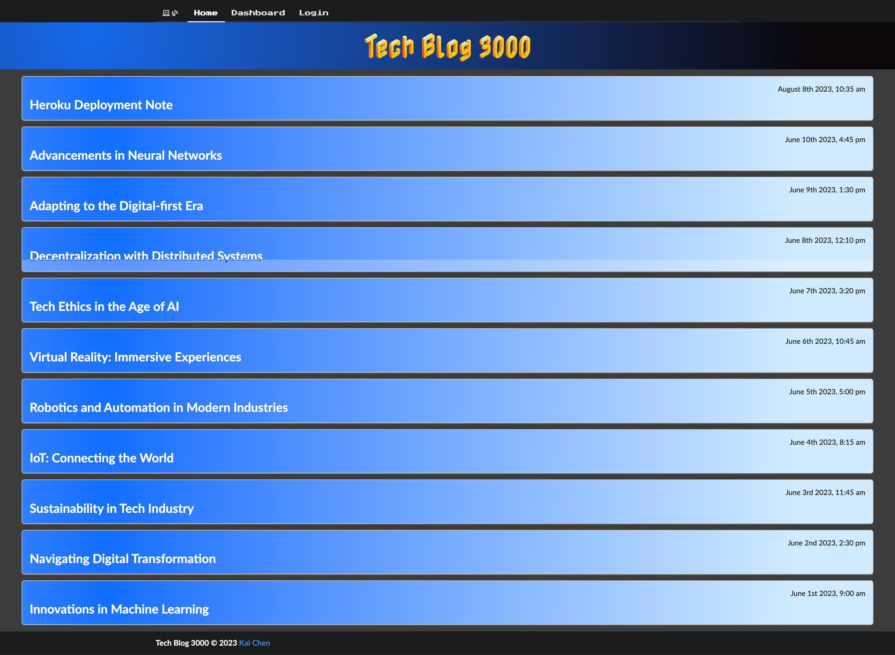
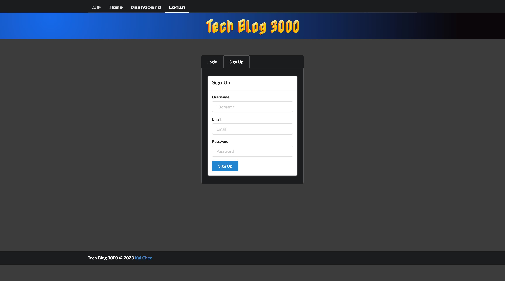
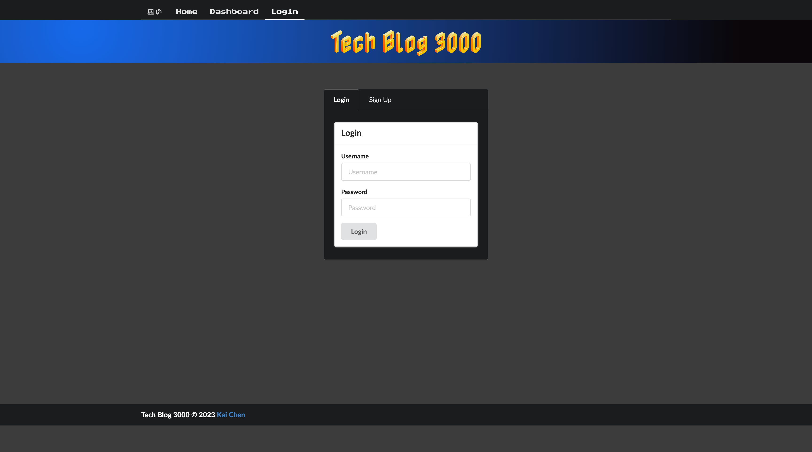
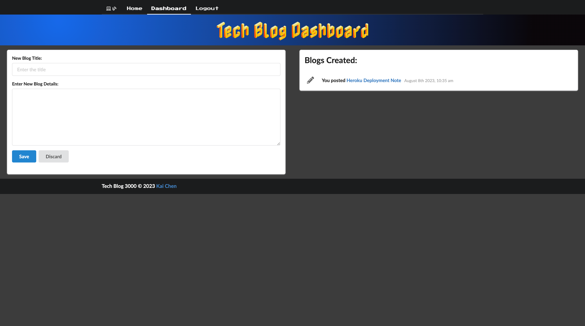
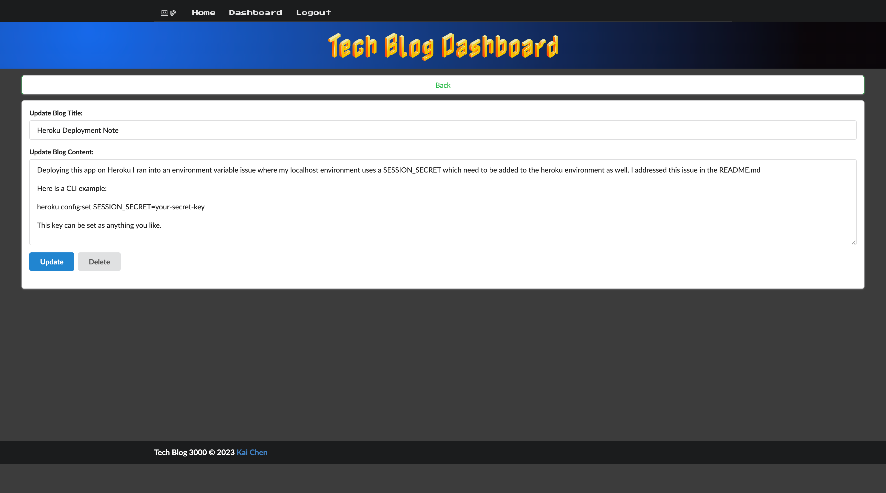

# Tech-Blog [](./LICENSE)

A CMS-style blog site similar to a Wordpress site, where developers can publish their blog posts and comment on other developers’ posts as well.

## Table of Contents

* [Description](#description)
* [Technology](#technology)
* [Installation](#installation)
* [Usage](#usage)
* [Screenshots](#screenshots)
* [Links](#links)
* [License](#license)

## Description

```md
AS A developer who writes about tech
I WANT a CMS-style blog site
SO THAT I can publish articles, blog posts, and my thoughts and opinions
```

[*back to top*](#table-of-contents)

## Technology

* [](https://nodejs.org/en)

* [](https://docs.npmjs.com/cli/v9/)
  * [](https://www.npmjs.com/package/bcrypt)
  * [](https://www.npmjs.com/package/connect-session-sequelize)
  * [](https://www.npmjs.com/package/dotenv)
  * [](https://www.npmjs.com/package/express)
  * [](https://www.npmjs.com/package/express-handlebars)
  * [](https://www.npmjs.com/package/express-session)
  * [](https://fomantic-ui.com/)
  * [](https://handlebarsjs.com/)
  * [](https://momentjs.com/)
  * [](https://www.npmjs.com/package/mysql2)
  * [](https://www.npmjs.com/package/sequelize)

[*back to top*](#table-of-contents)

## Installation

* Packages to support this application can be installed by using [*npm install*](https://docs.npmjs.com/cli/v9/commands/npm-install) commands.

> **Note**: If you do not have a `package.json` in your directory already, enter command below to [*initiate*](https://docs.npmjs.com/cli/v9/commands/npm-init).
>
>```bash
>npm init -y
>```
>
>```bash
>npm i bcrypt@5.1.0 connect-session-sequelize@7.1.7 dotenv@16.3.1 express@4.18.2 express-handlebars@7.1.1 express-session@1.17.3 fomantic-ui@2.9.2 handlebars@4.7.8 moment@2.29.4 mysql2@3.6.0 sequelize@6.32.1
>```
>
> **Important**: Please @ the **EXACT** versions as shown above to ensure the functionality of this application.

**Before you start, make sure to created a *`.env`* file in the root directory as the example shown below:**

```bash
DB_USER=root
DB_PASSWORD=your password to the database
DB_NAME=techBlog_db
DB_HOST=localhost
JAWSDB_URL=your JawsDB connection string
SESSION_SECRET=your-secret-key
```

* Source the `schema.sql` in `MySQL`:

```bash
mysql -u root -p
```

```mysql
source ./db/schema.sql
```

>Note: If you would like to `git fork` this repo and deploy it on *Heroku*, please make sure to set the environment variable with the `Heroku CLI` command below:
>
>```bash
>heroku config:set SESSION_SECRET=your-secret-key
>```
>

[*back to top*](#table-of-contents)

## Usage

* This application can be invoked by using the following command:

```bash
npm start
```

* Workflow:

```md
GIVEN a CMS-style blog site
WHEN I visit the site for the first time
THEN I am presented with the homepage, which includes existing blog posts if any have been posted; navigation links for the homepage and the dashboard; and the option to log in
WHEN I click on the homepage option
THEN I am taken to the homepage
WHEN I click on any other links in the navigation
THEN I am prompted to either sign up or sign in
WHEN I choose to sign up
THEN I am prompted to create a username and password
WHEN I click on the sign-up button
THEN my user credentials are saved and I am logged into the site
WHEN I revisit the site at a later time and choose to sign in
THEN I am prompted to enter my username and password
WHEN I am signed in to the site
THEN I see navigation links for the homepage, the dashboard, and the option to log out
WHEN I click on the homepage option in the navigation
THEN I am taken to the homepage and presented with existing blog posts that include the post title and the date created
WHEN I click on an existing blog post
THEN I am presented with the post title, contents, post creator’s username, and date created for that post and have the option to leave a comment
WHEN I enter a comment and click on the submit button while signed in
THEN the comment is saved and the post is updated to display the comment, the comment creator’s username, and the date created
WHEN I click on the dashboard option in the navigation
THEN I am taken to the dashboard and presented with any blog posts I have already created and the option to add a new blog post
WHEN I click on the button to add a new blog post
THEN I am prompted to enter both a title and contents for my blog post
WHEN I click on the button to create a new blog post
THEN the title and contents of my post are saved and I am taken back to an updated dashboard with my new blog post
WHEN I click on one of my existing posts in the dashboard
THEN I am able to delete or update my post and taken back to an updated dashboard
WHEN I click on the logout option in the navigation
THEN I am signed out of the site
WHEN I am idle on the site for more than a set time
THEN I am able to view posts and comments but I am prompted to log in again before I can add, update, or delete posts
```

[*back to top*](#table-of-contents)

## Screenshots

* Home Page

* Sign Up

* Login

* View Posts and Add Comments

* Dashboard/New Post

* Update/Delete


[*back to top*](#table-of-contents)

## Links

[](https://rb.gy/4mykl)

* GitHub Repo: [Tech-Blog](https://github.com/Ronin1702/E-commerce-Back-End)
* Deployed *Heroku* Application: [Tech-Blog-3000](https://tech-blog-3000-6aa1a4d8137a.herokuapp.com/)

[*back to top*](#table-of-contents)

## License

* This application is licensed by [](./LICENSE).

[*back to top*](#table-of-contents)

---
[](https://kaichen.biz)
